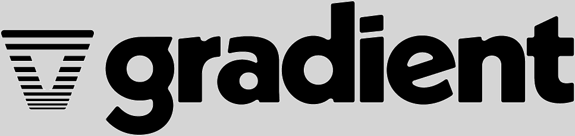
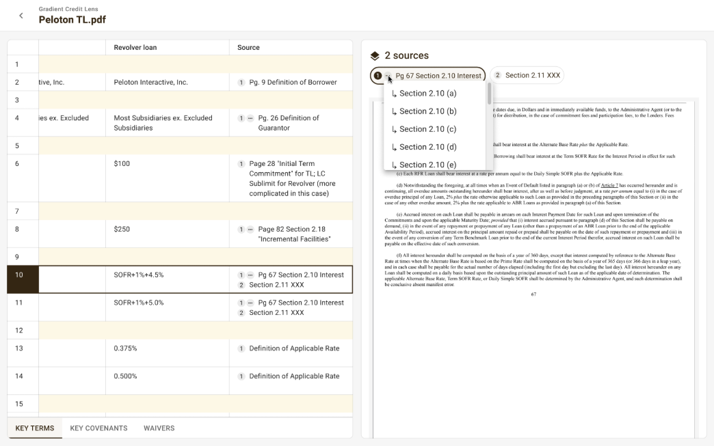
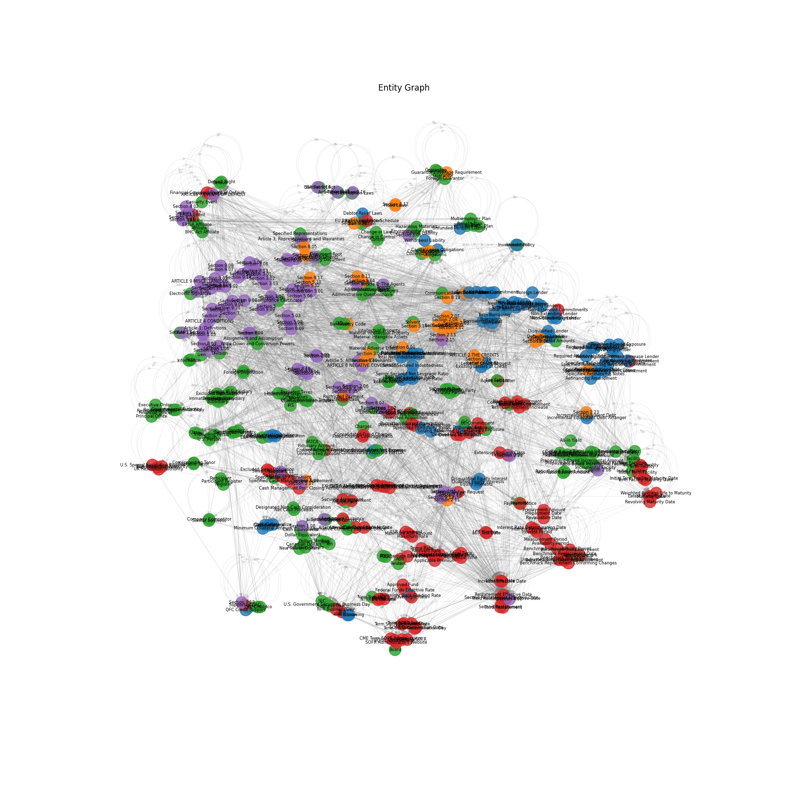

# FINOS DTCC Hackathon


# Gradient CreditAI


Gradient CreditAI is a credit investment copilot for deep diligence and risk mitigation, built on Gradient’s FinanceOS and Knowledge Engine.

Gradient CreditAI supports the following features:

* ** Easily analyze credit documents
    - CreditAI automatically interprets 100-page credit documents and outputs critical information about the loan agreement.

* ** Audit and view sources
    - Trace the key terms and reasoning throughout the legal contract.

* ** Track and review past investment agreements
    - Quickly review key details from past agreements to ensure ongoing adherence to covenants.



## Architecture

Gradient CreditAI is an app built on top of a handful of Gradient's core technologies:

* ** Gradient's Graph-Based Financial Knowledge Engine **
   * Comprised of two main components:
      * ** Gradient's Document Indexing and Knowledge Graph Engine **
      * ** Gradient's Research Agent / Co-pilot **
* ** Gradient's Layout Detection and Semantic Parsing Engine **
    * OCR, Layout Detection, and Semantic + Hierarchical Parsing
* ** Gradient's Document Annotation Suite **
   * A general front-end suite for annotating documents


## Example Problems

Prompt: "Detail the interest rate for the debt agreements."

Flow chart to arrive at the answer as an analyst:


## Example Knowledge Graph

TSNE-embedded knowledge graph of a credit agreement:



## Where to find more documents

* Go to [SEC EDGAR Filing Search](https://www.sec.gov/edgar/search/)
* Search for "loan agreement" or "credit agreement" + a company name
* Click into 8-K & 10-Q Filings and look at / download credit agreement exhibits.

### Project Details

Under construction.

### Team Information

Team members:
* Forrest Moret
* Ishan Kaul
* Joe Laurendi
* Leo Pekelis
* Mark Kim-Huang
* Ronak Bansal


## Using DCO to sign your commits

**All commits** must be signed with a DCO signature to avoid being flagged by the DCO Bot. This means that your commit log message must contain a line that looks like the following one, with your actual name and email address:

```
Signed-off-by: John Doe <john.doe@example.com>
```

Adding the `-s` flag to your `git commit` will add that line automatically. You can also add it manually as part of your commit log message or add it afterwards with `git commit --amend -s`.

See [CONTRIBUTING.md](./.github/CONTRIBUTING.md) for more information

### Helpful DCO Resources
- [Git Tools - Signing Your Work](https://git-scm.com/book/en/v2/Git-Tools-Signing-Your-Work)
- [Signing commits
](https://docs.github.com/en/github/authenticating-to-github/signing-commits)


## License

Copyright 2025 FINOS

Distributed under the [Apache License, Version 2.0](http://www.apache.org/licenses/LICENSE-2.0).

SPDX-License-Identifier: [Apache-2.0](https://spdx.org/licenses/Apache-2.0)


